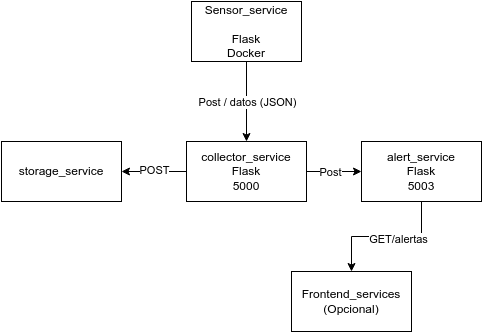
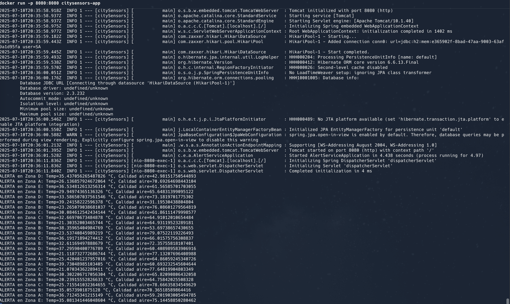

# Mini-Proyecto "city_monitor_springboot"
(Sistema Distribuido para Monitoreo Ambiental)

UEA: Sistemas Distribuidos

👥 Autores:

- Andrés Mateo Dorantes
- José Abraham Marín Sánchez
- Luis Antonio Salinas Mata

Objetivo:

Desarrollar un sistema distribuido que monitoree variables ambientales (temperatura y calidad del aire) en distintos barrios de una ciudad, utilizando una arquitectura basada en microservicios desacoplados.

La solución emplea:

- Java 17
- Spring Boot
- Comunicación RESTful
- Contenedores Docker para despliegue

# Arquitectura General

El sistema está compuesto por los siguientes módulos:

1. SimuladorAlerta (Cliente):
- Aplicación Java que simula sensores distribuidos.
- Genera lecturas aleatorias de temperatura y calidad del aire.
- Envia los datos periódicamente al backend mediante HTTP POST.
2. AlertService (Servidor)
- Microservicio hecho con Spring Boot que: Recibe los datos por POST en /evaluar.
- Evalúa si se superan los umbrales críticos.
- Registra las lecturas.
- Genera alertas cuando corresponde.
- Expone endpoints GET para consultar alertas y datos recibidos.

Diagrama de arquitectura:





# Tecnologías Usadas

- Lenguaje: Java 17
- Framework: Spring Boot 3.x
- Comunicación: HTTP REST
- Serialización: JSON
- IDE recomendado: NetBeans

# Reglas de Generación de Alertas

El servicio generará una alerta cuando:

- Temperatura > 35 °C

- Calidad del aire > 60

        # Ejemplo de alerta generada:

        ALERTA en Zona B: Temp=20.373335218080033 °C, Calidad aire=70.3382326888649

# API del servicio (AlertService)

| Método | Ruta       | Descripción                                               |
| ------ | ---------- | --------------------------------------------------------- |
| POST   | `/evaluar` | Recibe datos ambientales en JSON y evalúa alertas         |
| GET    | `/alertas` | Lista de todas las alertas generadas                      |
| GET    | `/datos`   | Lista de todos los datos recibidos                        |
| GET    | `/evaluar` | (Opcional) Mensaje informativo si se accede por navegador |


```json
Los datos se reciben en formato JSON como:
{"ALERTA en Zona D: Temp=35.437056265487826 °C, Calidad aire=42.98151750544893","ALERTA en Zona A: Temp=26.136857924672064 °C, Calidad aire=70.69264698443104","ALERTA en Zona E: Temp=36.534812613256314 °C, Calidad aire=61.56585701703055"}
```
# Cómo ejecutar

    Clona el repositorio:
```bash
    git clone https://github.com/Finot23/city_monitor_springboot
    cd city_monitor_springboot
```
Desde tu terminal crea la imagen de docker y ejecuta:
```bash
docker build -t citysensors-app .
docker run -p 8080:8080 citysensors-app

```
En paralelo, ejecuta el simulador:

```bash
# Desde tu IDE: ejecuta SimuladorAlerta.java
# O desde terminal:
mvn compile
mvn exec:java -Dexec.mainClass="com.example.alertservice.simulador.SimuladorAlerta"
```
Verifica en navegador:

    http://localhost:8080/alertas → lista de alertas
    http://localhost:8080/datos → todas las lecturas
    http://localhost:8080/evaluar → mensaje si accedes con navegador
# Ejemplo de como se veria el Docker en accion:

